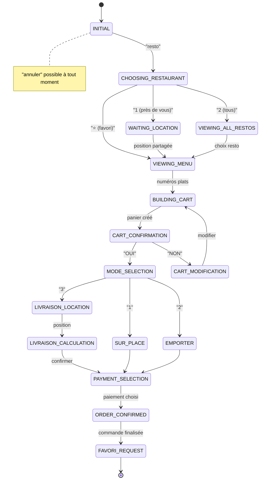

# 📋 PLAN COMPLET - Bot Restaurant WhatsApp Multi-Restos
## Architecture avec Supabase Edge Functions + Green API

---

## 🎯 Vue d'ensemble du système

### Stack Technique
- **Backend**: Supabase Edge Functions (TypeScript/Deno)
- **WhatsApp**: Green API (WhatsApp Business API Cloud)
- **Base de données**: Supabase (PostgreSQL)
- **Cache Sessions**: Supabase Storage ou Table sessions
- **Webhooks**: Supabase Edge Functions endpoints
- **Géolocalisation**: Calcul Haversine natif
- **Paiements**: Orange Money / Wave API

### Architecture Globale
```
┌─────────────────┐     ┌──────────────────┐     ┌─────────────────┐
│                 │     │                  │     │                 │
│  WhatsApp User  ├────►│   Green API      ├────►│ Supabase Edge   │
│                 │     │   (Webhooks)     │     │   Functions     │
└─────────────────┘     └──────────────────┘     └────────┬────────┘
                                                           │
                                                           ▼
                                               ┌───────────────────┐
                                               │  Supabase DB      │
                                               │  - restaurants    │
                                               │  - menus          │
                                               │  - commandes      │
                                               │  - clients        │
                                               │  - sessions       │
                                               └───────────────────┘
```

---

## 🗄️ Schémas Base de Données Supabase

### 1. Table `restaurants`
```sql
CREATE TABLE restaurants (
  id UUID PRIMARY KEY DEFAULT gen_random_uuid(),
  nom VARCHAR(255) NOT NULL,
  adresse TEXT NOT NULL,
  latitude DECIMAL(10, 8) NOT NULL,
  longitude DECIMAL(11, 8) NOT NULL,
  phone_whatsapp VARCHAR(20) NOT NULL,
  
  -- Paramètres de livraison
  tarif_km INTEGER DEFAULT 3000, -- GNF par km
  seuil_gratuite INTEGER DEFAULT 100000, -- Montant pour livraison gratuite
  minimum_livraison INTEGER DEFAULT 25000, -- Minimum de commande pour livraison
  rayon_livraison_km INTEGER DEFAULT 10, -- Rayon max de livraison
  
  -- Horaires et statut
  horaires JSONB DEFAULT '{}',
  statut VARCHAR(20) DEFAULT 'ouvert', -- ouvert/fermé/pause
  
  -- Métadonnées
  created_at TIMESTAMP WITH TIME ZONE DEFAULT NOW(),
  updated_at TIMESTAMP WITH TIME ZONE DEFAULT NOW()
);
```

### 2. Table `menus`
```sql
CREATE TABLE menus (
  id UUID PRIMARY KEY DEFAULT gen_random_uuid(),
  restaurant_id UUID REFERENCES restaurants(id) ON DELETE CASCADE,
  nom_plat VARCHAR(255) NOT NULL,
  description TEXT,
  prix INTEGER NOT NULL,
  categorie VARCHAR(100) DEFAULT 'plat',
  disponible BOOLEAN DEFAULT true,
  photo_url TEXT,
  ordre_affichage INTEGER DEFAULT 0,
  created_at TIMESTAMP WITH TIME ZONE DEFAULT NOW()
);
```

### 3. Table `clients`
```sql
CREATE TABLE clients (
  id UUID PRIMARY KEY DEFAULT gen_random_uuid(),
  phone_whatsapp VARCHAR(20) UNIQUE NOT NULL,
  nom VARCHAR(255),
  restaurant_favori_id UUID REFERENCES restaurants(id),
  adresse_default TEXT,
  latitude_default DECIMAL(10, 8),
  longitude_default DECIMAL(11, 8),
  created_at TIMESTAMP WITH TIME ZONE DEFAULT NOW(),
  last_order_at TIMESTAMP WITH TIME ZONE
);
```

### 4. Table `commandes`
```sql
CREATE TABLE commandes (
  id UUID PRIMARY KEY DEFAULT gen_random_uuid(),
  numero_commande VARCHAR(20) UNIQUE NOT NULL,
  client_id UUID REFERENCES clients(id),
  restaurant_id UUID REFERENCES restaurants(id),
  
  -- Détails commande
  items JSONB NOT NULL, -- [{menu_id, nom, quantite, prix_unitaire}]
  sous_total INTEGER NOT NULL,
  frais_livraison INTEGER DEFAULT 0,
  total INTEGER NOT NULL,
  
  -- Mode et livraison
  mode VARCHAR(20) NOT NULL, -- sur_place/emporter/livraison
  adresse_livraison TEXT,
  latitude_livraison DECIMAL(10, 8),
  longitude_livraison DECIMAL(11, 8),
  distance_km DECIMAL(5, 2),
  
  -- Statut et paiement
  statut VARCHAR(30) DEFAULT 'en_attente', -- en_attente/confirmee/preparation/livraison/terminee/annulee
  paiement_mode VARCHAR(30), -- maintenant/fin_repas/recuperation/livraison
  paiement_statut VARCHAR(20) DEFAULT 'en_attente', -- en_attente/paye/echoue
  paiement_methode VARCHAR(30), -- orange_money/wave/cash
  
  -- Timestamps
  created_at TIMESTAMP WITH TIME ZONE DEFAULT NOW(),
  confirmed_at TIMESTAMP WITH TIME ZONE,
  estimated_time TIMESTAMP WITH TIME ZONE,
  delivered_at TIMESTAMP WITH TIME ZONE
);
```

### 5. Table `sessions`
```sql
CREATE TABLE sessions (
  id UUID PRIMARY KEY DEFAULT gen_random_uuid(),
  phone_whatsapp VARCHAR(20) NOT NULL,
  state VARCHAR(50) NOT NULL,
  context JSONB DEFAULT '{}',
  expires_at TIMESTAMP WITH TIME ZONE NOT NULL,
  created_at TIMESTAMP WITH TIME ZONE DEFAULT NOW(),
  updated_at TIMESTAMP WITH TIME ZONE DEFAULT NOW()
);

-- Index pour les requêtes fréquentes
CREATE INDEX idx_sessions_phone ON sessions(phone_whatsapp);
CREATE INDEX idx_sessions_expires ON sessions(expires_at);
```

---

## 🔀 Workflows Détaillés

### WORKFLOW A: ACCUEIL ET CHOIX DU RESTAURANT

```typescript
// État: INITIAL → CHOOSING_RESTAURANT

1. Client tape "resto" ou message initial
   └─> Bot répond:
       "🍽️ Bienvenue chez Bot Resto Conakry!
        
        Comment souhaitez-vous trouver votre restaurant?
        
        1️⃣ Restos près de vous 📍
        2️⃣ Voir tous les restos 🍴
        ⭐ [Nom du favori] (si existe)
        
        Répondez avec le numéro de votre choix."

2. Si choix "1" (Près de vous):
   └─> Bot demande: "📍 Partagez votre position WhatsApp"
   └─> Client partage position
   └─> Bot calcule distances (Haversine)
   └─> Bot affiche:
       "📍 Restos proches de vous:
        
        1️⃣ Restaurant A (0.5 km)
        2️⃣ Restaurant B (1.2 km)  
        3️⃣ Restaurant C (2.0 km)
        4️⃣ Restaurant D (3.1 km)
        5️⃣ Restaurant E (4.5 km)
        
        Tapez le numéro du restaurant ou 'suivant' pour plus d'options."

3. Si choix "2" (Tous les restos):
   └─> Bot affiche liste paginée (5 par page):
       "🍴 Nos restaurants partenaires (Page 1/3):
        
        1️⃣ Restaurant A
        2️⃣ Restaurant B
        3️⃣ Restaurant C
        4️⃣ Restaurant D
        5️⃣ Restaurant E
        
        Tapez le numéro ou 'suivant' pour la page suivante."

4. Si choix "⭐" (Favori):
   └─> Accès direct au menu du restaurant favori
```

### WORKFLOW B: CONSTRUCTION DU PANIER

```typescript
// État: VIEWING_MENU → BUILDING_CART → CART_CONFIRMATION

1. Affichage du menu:
   "📋 Menu du jour - [Nom Restaurant]
    
    ENTRÉES:
    1️⃣ Salade César - 35,000 GNF
    2️⃣ Soupe du jour - 25,000 GNF
    
    PLATS:
    3️⃣ Poulet Yassa - 65,000 GNF
    4️⃣ Poisson Braisé - 75,000 GNF
    5️⃣ Riz Gras - 55,000 GNF
    
    Tapez 'suivant' pour voir les desserts et boissons.
    
    💡 Pour commander: envoyez les numéros (ex: 1,3,3 = 1 salade + 2 poulets)"

2. Client répond: "1,3,3,5"
   └─> Bot parse: 1x Entrée#1, 2x Plat#3, 1x Plat#5

3. Récapitulatif obligatoire:
   "🛒 Votre panier:
    
    • 1x Salade César - 35,000 GNF
    • 2x Poulet Yassa - 130,000 GNF  
    • 1x Riz Gras - 55,000 GNF
    
    ─────────────────
    💰 Sous-total: 220,000 GNF
    
    ✅ Confirmer cette commande? (OUI/NON)"

4. Si NON:
   "Que souhaitez-vous faire?
    
    1️⃣ Supprimer un article
    2️⃣ Ajouter d'autres articles
    3️⃣ Tout annuler et recommencer
    
    Répondez avec votre choix."
```

### WORKFLOW C: CHOIX DU MODE DE RÉCUPÉRATION

```typescript
// État: MODE_SELECTION → [SUR_PLACE|EMPORTER|LIVRAISON]

1. Après confirmation panier:
   "📦 Comment souhaitez-vous récupérer votre commande?
    
    1️⃣ Sur place 🍽️ (manger au restaurant)
    2️⃣ À emporter 📦 (récupérer et partir)
    3️⃣ Livraison 🛵 (recevoir chez vous)
    
    Répondez avec votre choix."
```

### WORKFLOW C1: SUR PLACE

```typescript
// État: SUR_PLACE → PAYMENT_SELECTION → ORDER_CONFIRMED

"🍽️ Commande sur place confirmée!

💳 Quand souhaitez-vous payer?

1️⃣ Maintenant (paiement mobile)
2️⃣ À la fin du repas (sur place)

Répondez avec votre choix."

→ Si maintenant: workflow paiement
→ Si fin repas: confirmation directe

"✅ Commande #2024-001 confirmée!

📍 Rendez-vous: [Nom Restaurant]
📱 Montrez ce numéro à l'accueil
⏱️ Table prête dans ~10-15 minutes

Tapez 'annuler' si besoin de modifier."
```

### WORKFLOW C2: À EMPORTER

```typescript
// État: EMPORTER → PAYMENT_SELECTION → ORDER_CONFIRMED

"📦 Commande à emporter confirmée!

💳 Quand souhaitez-vous payer?

1️⃣ Maintenant (paiement mobile)
2️⃣ À la récupération (au restaurant)

Répondez avec votre choix."

"✅ Commande #2024-002 confirmée!

📍 À récupérer: [Nom Restaurant]
⏱️ Prête dans ~20-25 minutes
💰 Total à payer: 220,000 GNF

Nous vous préviendrons quand c'est prêt!"
```

### WORKFLOW C3: LIVRAISON

```typescript
// État: LIVRAISON → LOCATION_REQUEST → DELIVERY_CALCULATION → PAYMENT

1. Demande de position:
   "🛵 Pour la livraison, partagez votre position WhatsApp 📍"

2. Vérifications et calculs:
   a) Vérifier minimum de commande:
      Si sous_total < minimum_livraison:
      "⚠️ Le minimum pour livraison est 25,000 GNF
       Votre panier: 20,000 GNF
       
       1️⃣ Ajouter des articles
       2️⃣ Choisir 'À emporter' 
       3️⃣ Annuler la commande"

   b) Calculer distance (Haversine):
      distance_km = calculateHaversine(resto_coords, client_coords)
      distance_arrondie = Math.ceil(distance_km)

   c) Calculer frais:
      if (sous_total >= seuil_gratuite) {
        frais = 0
        message = "🎉 Livraison GRATUITE! (commande > 100,000 GNF)"
      } else {
        frais = distance_arrondie * tarif_km
        message = `🚚 Frais de livraison: ${frais} GNF (${distance_arrondie}km)`
      }

3. Affichage final:
   "📍 Adresse de livraison confirmée
    
    🛒 Sous-total: 220,000 GNF
    🚚 Livraison: GRATUITE ✅
    ─────────────────
    💰 Total: 220,000 GNF
    
    ✅ Confirmer cette livraison? (OUI/NON)"

4. Paiement:
   "💳 Mode de paiement:
    
    1️⃣ Payer maintenant (Orange Money/Wave)
    2️⃣ Payer à la livraison (cash)
    
    Répondez avec votre choix."

5. Confirmation finale:
   "✅ Commande #2024-003 confirmée!
    
    🛵 Livraison en cours
    📍 Adresse: [adresse géocodée]
    ⏱️ Arrivée estimée: 30-40 minutes
    👤 Livreur: En cours d'attribution
    
    Nous vous contacterons à l'approche!"
```

### WORKFLOW D: SYSTÈME DE FAVORIS

```typescript
// Après chaque commande réussie:

"⭐ Souhaitez-vous enregistrer [Nom Restaurant] comme favori?

Cela vous permettra d'y accéder plus rapidement la prochaine fois.

Répondez OUI ou NON"

→ Si OUI: sauvegarde en base
→ Prochaine session: apparaît en accueil avec ⭐
```

### WORKFLOW E: GESTION ANNULATION

```typescript
// À tout moment, si message contient "annuler":

"❌ Commande annulée.

Que souhaitez-vous faire?

1️⃣ Recommencer avec un autre restaurant
2️⃣ Quitter

Répondez avec votre choix."
```

---

## 🏗️ Structure des Edge Functions Supabase

```
supabase/functions/
├── webhook-whatsapp/
│   └── index.ts                 # Point d'entrée webhook Green API
├── shared/
│   ├── types.ts                 # Types TypeScript partagés
│   ├── database.ts              # Client Supabase
│   ├── green-api.ts             # Client Green API
│   └── constants.ts             # Constantes système
├── handlers/
│   ├── message-router.ts        # Routeur principal des messages
│   ├── accueil-handler.ts       # Gestion accueil et choix resto
│   ├── menu-handler.ts          # Affichage menu et sélection
│   ├── panier-handler.ts        # Construction et validation panier
│   ├── mode-handler.ts          # Choix mode récupération
│   ├── livraison-handler.ts     # Calculs livraison
│   └── paiement-handler.ts      # Gestion paiements
├── services/
│   ├── session-service.ts       # Gestion des sessions
│   ├── location-service.ts      # Calculs géographiques
│   ├── message-formatter.ts     # Formatage messages WhatsApp
│   ├── parser-service.ts        # Parse réponses numérotées
│   └── notification-service.ts  # Envoi notifications
└── utils/
    ├── haversine.ts             # Calcul distance
    ├── validators.ts            # Validations données
    └── errors.ts                # Gestion erreurs
```

### Edge Function Principal (webhook-whatsapp/index.ts)

```typescript
import { serve } from 'https://deno.land/std@0.168.0/http/server.ts'
import { createClient } from '@supabase/supabase-js'
import { handleIncomingMessage } from '../handlers/message-router.ts'
import { GreenAPIWebhook } from '../shared/types.ts'

serve(async (req) => {
  try {
    // Vérifier méthode POST
    if (req.method !== 'POST') {
      return new Response('Method not allowed', { status: 405 })
    }

    // Parser le webhook Green API
    const webhook: GreenAPIWebhook = await req.json()
    
    // Router selon le type de message
    if (webhook.typeWebhook === 'incomingMessageReceived') {
      const response = await handleIncomingMessage(webhook)
      return new Response(JSON.stringify(response), {
        headers: { 'Content-Type': 'application/json' },
        status: 200
      })
    }

    return new Response('OK', { status: 200 })
  } catch (error) {
    console.error('Webhook error:', error)
    return new Response('Internal error', { status: 500 })
  }
})
```

---

## 📊 Diagramme d'États



---

## 🔧 Configuration Green API

### Webhook Setup
```typescript
// Configuration dans Green API Dashboard
{
  webhookUrl: "https://[project-id].supabase.co/functions/v1/webhook-whatsapp",
  webhookEvents: [
    "incomingMessageReceived",
    "outgoingMessageStatus",
    "stateInstanceChanged"
  ]
}
```

### Envoi de Messages
```typescript
// Exemple d'envoi avec Green API
async function sendMessage(phone: string, message: string) {
  const response = await fetch(
    `https://api.green-api.com/waInstance${instanceId}/sendMessage/${apiTokenInstance}`,
    {
      method: 'POST',
      headers: { 'Content-Type': 'application/json' },
      body: JSON.stringify({
        chatId: `${phone}@c.us`,
        message: message
      })
    }
  )
  return response.json()
}

// Envoi avec boutons (si supporté)
async function sendButtonMessage(phone: string, text: string, buttons: Button[]) {
  const response = await fetch(
    `https://api.green-api.com/waInstance${instanceId}/sendButtons/${apiTokenInstance}`,
    {
      method: 'POST',
      headers: { 'Content-Type': 'application/json' },
      body: JSON.stringify({
        chatId: `${phone}@c.us`,
        message: text,
        footer: "Bot Resto Conakry",
        buttons: buttons.map((btn, idx) => ({
          buttonId: idx.toString(),
          buttonText: { displayText: btn.text }
        }))
      })
    }
  )
  return response.json()
}

// Envoi de localisation
async function sendLocation(phone: string, lat: number, lng: number, name: string) {
  const response = await fetch(
    `https://api.green-api.com/waInstance${instanceId}/sendLocation/${apiTokenInstance}`,
    {
      method: 'POST',
      headers: { 'Content-Type': 'application/json' },
      body: JSON.stringify({
        chatId: `${phone}@c.us`,
        latitude: lat,
        longitude: lng,
        nameLocation: name,
        address: "Conakry, Guinée"
      })
    }
  )
  return response.json()
}
```

---

## 📝 Variables d'Environnement

```env
# Supabase
SUPABASE_URL=https://[project-id].supabase.co
SUPABASE_ANON_KEY=eyJ...
SUPABASE_SERVICE_KEY=eyJ...

# Green API
GREEN_API_INSTANCE_ID=1101234567
GREEN_API_TOKEN=abc123...

# Configuration Bot
BOT_PHONE_NUMBER=224612345678
DEFAULT_TIMEOUT_MINUTES=30
MAX_ITEMS_PER_PAGE=5

# Paiements (optionnel)
ORANGE_MONEY_API_KEY=...
WAVE_API_KEY=...
```

---

## 🚀 Commandes de Déploiement

```bash
# Déployer une edge function
supabase functions deploy webhook-whatsapp

# Tester localement
supabase functions serve webhook-whatsapp --env-file .env.local

# Voir les logs
supabase functions logs webhook-whatsapp

# Mettre à jour les secrets
supabase secrets set GREEN_API_TOKEN=abc123...
```

---

## 📐 Calcul Haversine (TypeScript)

```typescript
// utils/haversine.ts
export function calculateDistance(
  lat1: number, 
  lon1: number, 
  lat2: number, 
  lon2: number
): number {
  const R = 6371 // Rayon de la Terre en km
  const dLat = toRad(lat2 - lat1)
  const dLon = toRad(lon2 - lon1)
  
  const a = 
    Math.sin(dLat/2) * Math.sin(dLat/2) +
    Math.cos(toRad(lat1)) * Math.cos(toRad(lat2)) *
    Math.sin(dLon/2) * Math.sin(dLon/2)
  
  const c = 2 * Math.atan2(Math.sqrt(a), Math.sqrt(1-a))
  return R * c
}

function toRad(deg: number): number {
  return deg * (Math.PI/180)
}

// Arrondir au km supérieur
export function roundUpKm(distance: number): number {
  return Math.ceil(distance)
}
```

---

## ✅ Checklist de Mise en Production

- [ ] Créer projet Supabase
- [ ] Configurer les tables et RLS policies
- [ ] Créer compte Green API
- [ ] Déployer les Edge Functions
- [ ] Configurer les webhooks Green API
- [ ] Tester flux complet (accueil → commande → paiement)
- [ ] Configurer monitoring et alertes
- [ ] Former les restaurants partenaires
- [ ] Préparer documentation utilisateur
- [ ] Lancer en beta avec 2-3 restaurants
- [ ] Ajuster selon retours
- [ ] Déploiement complet